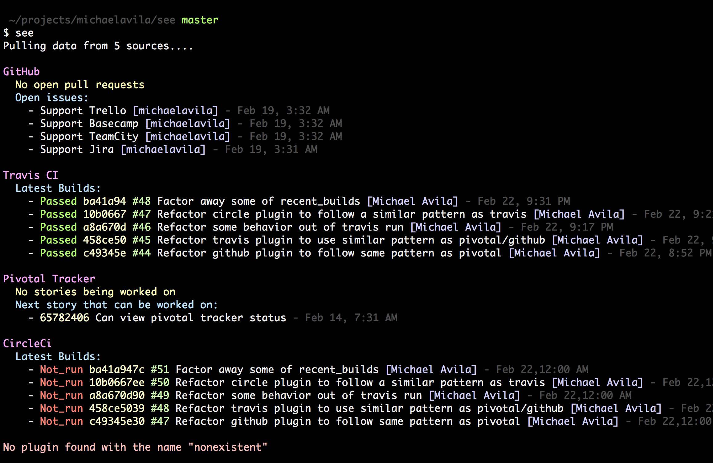

# SEE

The purpose of see is to provide a useful view of all of the information related to your project concisely and in a single command. Now projects vary quite a lot and so this versatility is achieved through plugins. Here is what it looks like to "see" this project:

## Installation

Use rubygems:

    gem install see

Or add it to your Gemfile

    gem 'see'
